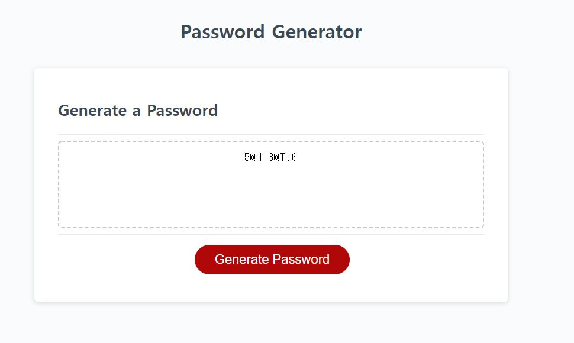

# Module-3-Challenge

## Description

This assignment is about creating an application that an employee can use to generate a random password based on criteria they have selected. The application will run in the browser, and will feature dynamically updated HTML and CSS powered by JavaScript code that I write. It will have a clean and polished user interface that is responsive, ensuring that it adapts to multiple screen sizes.

## Criterias for random password generator
* Random password will be created when users click 'Generate Password' button.
* When users click the button, a series of prompts for password criteria must be shown.
* The password must be at least 8 characters and no more than 128 characters.
* Confirm whether or not to include lowercase, uppercase, numeric, and special characters to users desired password.
* Input should be validated and at least one character type must be selected.
* Password is either displayed in an alert of written to the page.

## Steps taken to create random password generator
* Clone and pull the starter code: [Link to the Starter Code](https://github.com/coding-boot-camp/friendly-parakeet).
* Write codes in JavaScript to meet the password criteria:
    * Example I: Assign required variables to make the application work, such as length, lowercase and uppercase alphabets, special character, and etc.
    * Example II: Use if/while/for to make criterias, such as password length, type of character requirements, and etc.  
* Add comments to JavaScript of what each line of codes do.
* Check if the application works properly and meets all password criterias.
* Finally, created a repository for the challenge and pushed all necessary files for this challenge!

## Challenges! 

There were quite a few challenging moments that I went through while creating an application for the random password generator.
* Since the starter code already had some variable already assigned, as well as functions necessary for the application; it somewhat made it more difficult because I had to use those variables and make new function out of it.
* I had to fully understand syntax of while/if/for to properly implement it to JavaScript.
    * I also had to research the difference between while loop and if statement.
* Using correct variable names for the function was sometimes confusing and I had to refer to class materials.

## Screenshot of the application and Link to deployed application
* [Link to the deployed application](https://hhealing123.github.io/Module-3-Challenge/).
* Screenshot of the application:

## Final Thoughts
* I really enjoyed creating the random password generator application using JavaScript because I always wanted to use JavaScript as it looked very interesting and fun computer language. While creating the application I went through quite a few troubles when making the application, I definitely learned numerous syntax and what each commands do. An important thing that I learned while making this application was that there are numerous ways of creating a random password generator. For instance, the writer can use if statement to create criteria(s) for the password instead of using while loop which is the way I did it; hence, I learned that it is very important to think wider when it comes to writing codes. I personally think this challenge was moderately an easy JavaScript assignment compared to other JavaScript challenges that I have seen in Youtube, Google, or Free-resource Websites; however, I believe this has provided me with a better understanding of how JavaScript works, such as syntax and assigning variables. Hence, in the future I would like to use what I have learned from this assignment to challenge myself to more advanced JavaScript projects.

## Utilized References
* https://endubueze00.medium.com/javascript-basics-string-concatenation-with-variables-and-interpolation-deba239debbe#:~:text=You%20write%20the%20string%20as,is%20much%20easier%20to%20read
* https://betterprogramming.pub/how-to-pick-between-a-while-and-for-loop-14ef217c3776#:~:text=Use%20a%20for%20loop%20when,the%20increment%20value%20is%20nonstandard.
* https://developer.mozilla.org/en-US/docs/Web/API/Document
* https://developer.mozilla.org/en-US/docs/Web/JavaScript/Reference/Global_Objects/Math/random
* https://developer.mozilla.org/en-US/docs/Web/API/Document/querySelector